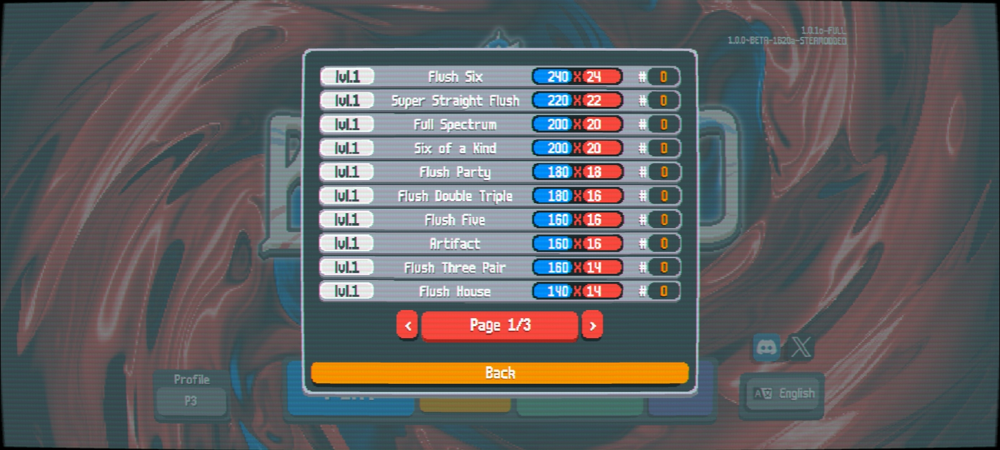
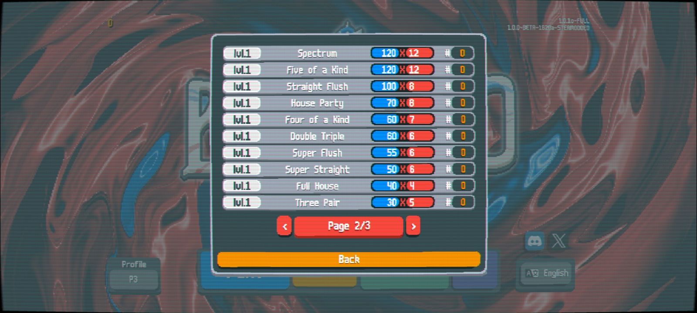
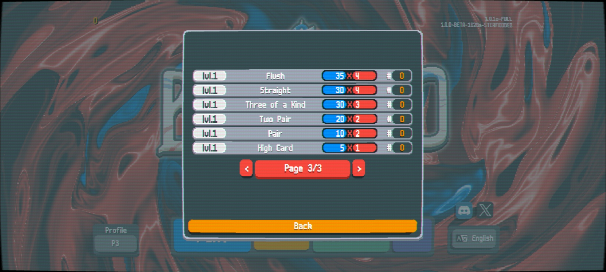
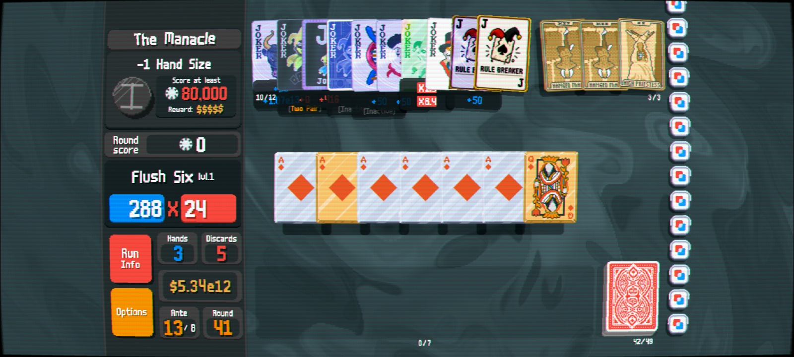
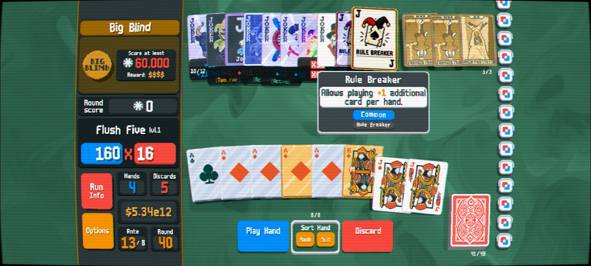

## After-Five-Api

An api for balatro to play hands beyond 5 cards.

Based on "one too many api" (thanks to the people) with some changes & fixes. At the moment it is similar to one too many api but in future there are plans to add exotic hand types so you can embrace the true spirit of balatro where no hand is wrong play if you build your deck around it.

use the joker mod Rule Breaker for seamless integration. Designed to work with Steamodded and modded Balatro setups.

#Features

Increase playable hand size dynamically

Increase discard selection size

Joker-driven hand expansion

API support for other mods

Compatible with Steamodded

Lightweight implementation

#Preview

Hands

More hands

Even more hands

custom Hand Support

Mod Showcase

#Installation

requirements:

Steamodded 1*

Lovely Injector 0.7*

Rule Breaker joker

https://github.com/RakibRyan/Rule-Breaker-Joker

Place the mod folder inside your Balatro mods directory.

Launch the game.

#Example

The Rule Breaker Joker increases the maximum selectable cards by +1.

Multiple copies stack together.

#Compatibility & recommendations 

it should be compatible with most mods as long as they Don't override core game logic. 
For best experience use 6 suits mod.

#Credits

Created for Balatro modding and custom gameplay experimentation.

Inspired by chaotic deckbuilding mechanics and hand-limit breaking gameplay.

